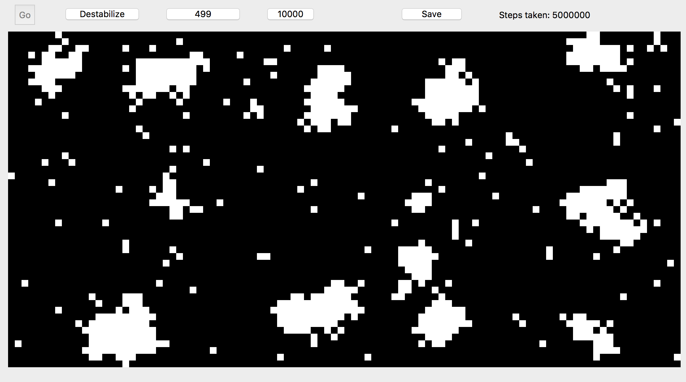

# Replicating a Phase Separation Model of Long Term Spatial Memory
Final Project submitted for APSC_456 Random Walks in Biology (Spring 2018) at William & Mary

by Kalen Clifton and Ethan Jones

## Introduction/Background:
Response to spatial information is an important and commonly occuring phenomena in a wide variety of biological systems [1]. Individual cells in both multicellular and single cellular systems often need to detect and react to the presence of external concentration gradients [2,3]. This detection of and reaction to external gradients is present in a number of important phenomena such as development, cellular motility, stem cell maintenance, and cancer. Recently, there has been a great deal of focus on the importance of intracellular gradients, which have been found to be mechanistically important for processes such as development [4]. While in some cases it has been found that intracellular gradients are generated from extracellular gradients [5], many intracellular gradients can also be produced in constant environments or by a transient signal [4].

Usually, it is assumed that regardless of their origin, these intracellular gradients are created and maintained by complex genetic or signalling networks. However, it has also been proposed that these intracellular gradients can occur by phase separation [6], a process where interactions between individual biochemical molecules (nucleic acids or proteins typically), drive the assembly of large scale complexes. These phase separated complexes form liquid-like droplets, which can move throughout cells and merge together into larger droplets, similar to bubbles of oil in water.

Recently, a number of proteins involved in the generation of intracellular concentration gradients have been found to contain intrinsically disordered domains, which are a hallmark of proteins involved in phase separation [7]. These intrinsically disordered domains have been implicated in sequestration of transcription factors, nuclear spatial organization, replication complexes, and cellular stress response. One prominent example of phase separation and spatial organization in proteins containing intrinsically disordered domain is the presence of P-bodies in axons. P-bodies are small phase separated droplets which contain RNA along with many different RNA processing enzymes. These P-bodies have been shown to exhibit phase separation in axons, where they have been shown to disaggregate in the presence of appropriate stimulus, allowing localized translation of mRNA [8].

In their paper “*Protein phase separation provides long-term memory of transient spatial stimuli*” Dine et al. develop and validate a model for intracellular spatial memory using protein aggregation and phase separation. After developing and validating their model *in silico* they then created a novel light inducible phase separation protein, which they used to validate their model’s results *in vivo*. For our project, we recreated their model based on their methods, and sought to recapitulate some of their findings.

## Our Implementation of Simulation
### Overview
We implemented our version of the simulation using python. We used the `pyqt` package to create an interactive GUI and visualization, and used various SciPy packages such as NumPy to implement the actual simulation. Our simulation is made up of two python files: the first, `MoveProtein.py` contains the main protein movement function (detailed below), the second, `Drawing.py` contains the GUI elements as well as the data for each square on the grid. To run the simulation only `Drawing.py` needs to be run. Our simulation uses python 3 (preferably Anaconda), if needed `pyqt` can be installed with the command `pip3 install pyqt5`.
 
### GUI Interface

The GUI should be simple to operate. From right to left the elements are: 
- Step counter (number of steps the simulation has taken thus far),
- batch size (number of steps to take for each batch run), 
- batch number (number of batches to run), 
- Destabilize (activates the destabilization function, which doubles the temperature on the right half of the grid), 
- Go (runs the simulation). 

Batch size and batch number can be clicked to alter their values, and Go and Destabilize can be clicked to perform their functions. The Destabilize element is a toggle switch, so when clicked the button reads "Stabilize". Clicking the Stabilize button, divides the temperature by two on the right half of the grid. If the simulation is set to record, data can be saved (written to csv) by pressing the save button.

Note that the batch size and batch number settings are multiplicative. The simulation is initialized with a batch number of 10 and a batch size of 1. When go is clicked, 10 total steps will be taken. The simulation performs identically regardless of batch number and size (i.e. there is no difference between batch number 100 and batch size 1, and batch number 1 and batch size 100). Since the main limiter of simulation speed is the visualization of the board, higher batch sizes will enable quicker simulations.

Additionally, note that once Go is clicked, it is not possible to interrupt the simulation until it completes unless you quit the program.
The simulation grid is represented with the same color scheme as in the paper, where white represents the presence of a protein and black the absence.

### Simulation Overview
The simulation is initialized and 700 squares of the 50x100 grid are filled with proteins (this is done with a uniform random distribution). The temperature of each square of the grid is set to 1. Each time a step is taken, the function `MoveProtein()` is called. The inputs passed into the function include the occupancy of all positions on the grid, the temperature of all positions at that time, and the size of the grid. `MoveProtein` picks a random protein (occupied square), calculates the reaction rate of movement of that protein to a randomly chosen neighboring unoccupied position, and moves the protein if a number chosen from the uniform random distribution on the interval (0,1] is greater than the reaction rate.

The boundaries are reflective so proteins are only allowed to move to positions within the grid and the total number of occupied positions is constant. To choose the direction for potential movement of a protein, we begin with a list of all eight neighboring positions and eliminate the positions that are not possible based on the boundaries of the grid. From the remaining positions, one position is chosen at random. Next, the occupancy of the position is determined from the array that stores the occupancy of all positions. If the selected position is unoccupied, then we calculate $n_{lost}$, the number of occupied neighboring positions for the protein that will potentially be moved. Considering the movement of a protein as an energy problem, the value of $n_{lost}$ is also the number of bonds that would be broken if the protein were to diffuse to new position.

Subsequently, the reaction rate, $k$, is calculated. 

$$ k = k_0 * \exp{\frac{\Delta E* n_{lost}}{\theta(x,y,t)}} $$

- $\Delta E$ = interaction energy = 1
- $n_{lost}$ = number of bonds broken
- $\theta (x,y,t)$ = temperature-like stimulus
- $k_0$ = constant = 1

As described above, the reaction rate is dependent on  $n_{lost}$ , 
the number of neighbors as well as a temperature stimulus, $\theta$ . 
For high values of $\theta$ , the reaction rate will decrease. Furthermore, the reaction rate is a function of 
$\Delta E$, the binding energy for each bond, and 
$k_0$, the "off-rate for the breaking a single interaction" [1]. 
To allow the probability of diffusion with no bonds broken to equal one, we let $\Delta E$ and $k_0$ equal one.

Lastly, a random number is chosen from the uniform random distribution on the interval (0,1] and is compared to the reaction rate, $k$. If $k$ is greater than the random number, then the current position of the protein becomes unoccupied and the unoccupied position which has been selected for the protein to move to becomes occupied. By this algorithm, some steps are completed without the protein moving to a new position. There are two scenarios when no movement occurs. The first is when the reaction rate is less than the random number. The second is when the randomly selected position to move to is occupied.

If recording has been enabled, after each step the average cluster size of the total grid as well as the average cluster size of each half of the grid is calculated using the SciPy ndimage package. A cluster is a single connected component considering 8-connectivity. 

When the destabilization button is pressed, the right half of the grid has temperature increased from 1 to 2. If the destabilization button is pressed again, the temperature returns to 1 on the right half of the grid.

### Overview of tunable parameters:
For convenience, the code is organized in order of modeling relevance, with the gui and time keeping functions being placed last. This overview will proceed in order of the functions of the main `Drawing.py` file.

`__init__`:

- `self.destabilizationConstant`, this value is multiplied by the right half of the temperature array during destabilization. Higher values will lead to more destabilization, and values below zero will lead to increased stabilization.
- `self.record`, when set to True this causes the clustering after each step to be recorded 
- `self.gridSizeX`, the simulation should work with an arbitrary board size, as long as it is twice as long in width as it is in height
  
`dataInit`:

- `initialProtein`, the number of proteins to start with
- `self.occupationData`, this is the np array that stores whether a protein is located in a given square or not (1 = True, 0 =False); The initial conditions are currently generated by using `np.choice` to randomly pick and assign a 0 or 1 from “temp” without replacement . This generates a uniform distribution. This could be replaced by a specific array, or by a different function, so long as the end result is an array of 0s and 1s of dimension Y by X. 
- `self.temperatureData`, this is the np array that stores the temperature of each square; it currently initializes to a value of 1. This could be changes to anything so long as the end result is a Y by X array of values >0. Note that when destabilization ends, the temperature will be set to 1 unless a modification is made to that function as well.

`destabilization`:

- `self.temperatureData` (line 67), this is what the temperature will be set back to when destabilization ends
- lines 74 and 75: this comprises setting the right half of the grid to temperature = 2 when destabilization begins. A different function could be used to destabilize different areas, for different temperatures, it would be easiest to use self.destabilization constant.
- `calculateClusters`:
This function calculates the mean cluster size of the entire, left half and right half portions of the grid at each step.

## Reference
- [1] McGinnis, W., & Krumlauf, R. (1992). Homeobox genes and axial patterning. Cell, 68(2), 283-302. 
- [2] Wadhams, G. H., & Armitage, J. P. (2004). Making sense of it all: bacterial chemotaxis. Nature Reviews Molecular Cell Biology, 5(12), 1024.
- [3] Van Haastert, P. J., & Devreotes, P. N. (2004). Chemotaxis: signalling the way forward. Nature reviews Molecular cell biology, 5(8), 626.
- [4] Prentice-Mott, H.V., Meroz, Y., Carlson, A., Levine, M.A., Davidson, M.W., Irimia, D., Charras, G.T., Mahadevan, L., and Shah, J.V. (2016). Directional memory arises from long-lived cytoskeletal asymmetries in polarized chemotactic cells. Proceedings of the National Academy of Sciences of the United States of America *113*, 1267-1272.
- [5] K. Tarbashevich, M. Reichman-Fried, C. Grimaldi, E. Raz, Chemokine-dependent pH elevation at the cell front sustains polarity in directionally digrating zebrafish germ cells. *Curr. Biol*. **25**, 1096–1103 (2015) 
- [6] Shin, Y., and Brangwynne, C.P. (2017). Liquid phase condensation in cell physiology and disease. Science *357*.
- [7] Dine, E. A., Gil, A. A., Uribe, G., Brangwynne, C. P., & Toettcher, J. E. (2018). Protein phase separation provides long-term memory of transient spatial stimuli. bioRxiv, 9243, 283804. [http://doi.org/10.1101/283804](http://doi.org/10.1101/283804)
- [8] Nicolas Cougot, Suvendra N. Bhattacharyya, Lucie Tapia-Arancibia, Remy Bordonné, Witold Filipowicz, Edouard Bertrand and Florence Rage. (2008). Dendrites of Mammalian Neurons Contain Specialized P-Body-Like Structures That Respond to Neuronal Activation. Journal of Neuroscience 17 December 2008, 28 (51) 13793-13804. [https://doi.org/10.1523/JNEUROSCI.4155-08.2008](https://doi.org/10.1523/JNEUROSCI.4155-08.2008)
- [9] Shin, Y., Berry, J., Pannucci, N., Haataja, M.P., Toettcher, J.E., and Brangwynne, C.P. (2017). Spatiotemporal Control of Intracellular Phase Transitions Using Light-Activated optoDroplets. Cell *168*, 159-171 e114.
